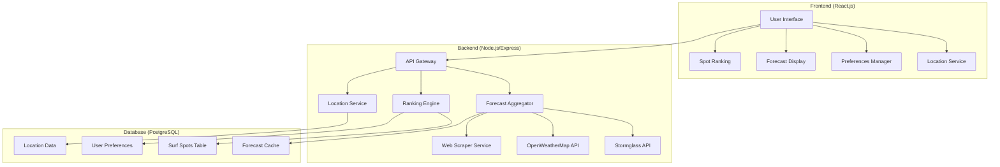
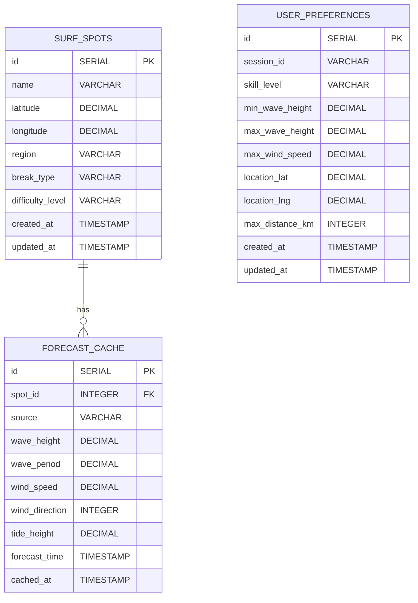
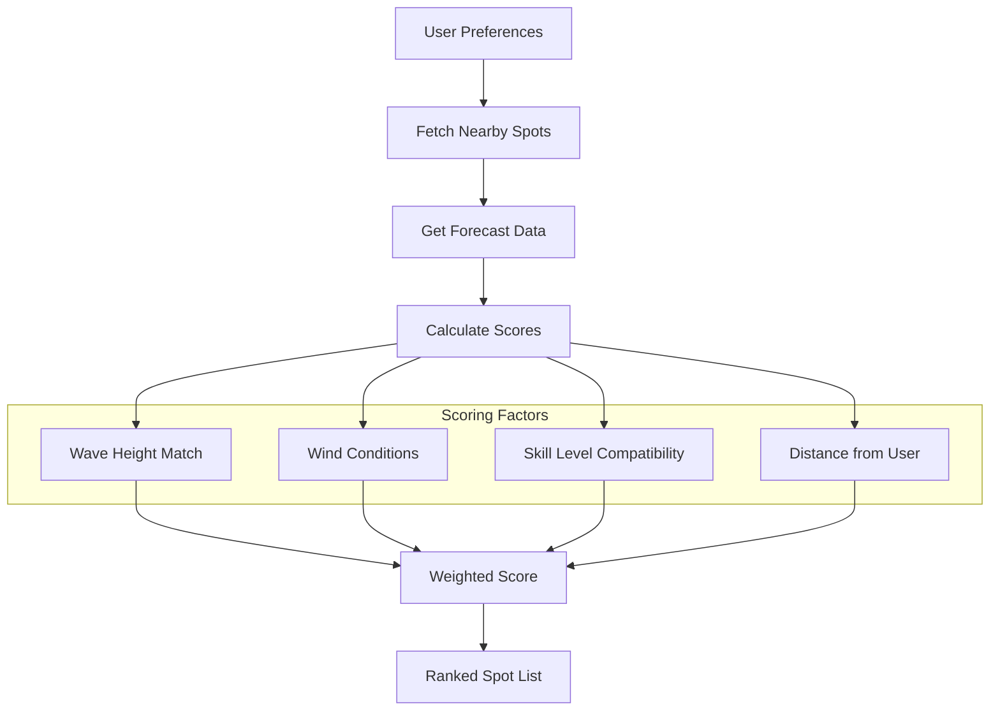

# Surf Forecast Web App - Architectural Plan

## Project Overview
A React.js web application that aggregates surf forecasts from multiple free APIs, ranks California surf spots based on user preferences (skill level, wave height, wind tolerance), and provides location-based recommendations.

## Technology Stack
- **Frontend**: React.js with modern hooks, React Router, Axios for API calls
- **Backend**: Node.js with Express.js framework
- **Database**: PostgreSQL for surf spots, user preferences, and cached forecast data
- **APIs**: Stormglass (free tier), OpenWeatherMap Marine API, selective web scraping
- **Geolocation**: Browser Geolocation API + manual search
- **Styling**: CSS Modules or Styled Components

## System Architecture



## Database Schema



## Core Features & Components

### 1. Frontend Components
- **LocationSelector**: Geolocation detection + manual search
- **PreferencesForm**: Skill level, wave height range, wind tolerance
- **SpotList**: Ranked list of surf spots with forecast summaries
- **SpotDetail**: Detailed forecast for individual spots
- **ForecastChart**: Visual representation of wave/wind conditions

### 2. Backend Services
- **ForecastAggregator**: Collects data from multiple APIs
- **RankingEngine**: Scores spots based on user preferences
- **CacheManager**: Stores and manages forecast data
- **LocationService**: Handles geolocation and spot proximity

### 3. API Integration Strategy
- **Stormglass API**: Primary marine weather data
- **OpenWeatherMap**: Backup/supplementary weather data
- **Web Scraping**: Selective scraping of public forecast data (respecting robots.txt)
- **Rate Limiting**: Implement caching and request throttling

## Ranking Algorithm



## Project Structure
```
surf-forecast-app/
├── client/                 # React frontend
│   ├── src/
│   │   ├── components/
│   │   ├── services/
│   │   ├── hooks/
│   │   └── utils/
│   ├── public/
│   └── package.json
├── server/                 # Node.js backend
│   ├── src/
│   │   ├── routes/
│   │   ├── services/
│   │   ├── models/
│   │   ├── middleware/
│   │   └── utils/
│   ├── migrations/
│   └── package.json
├── database/
│   ├── migrations/
│   └── seeds/
└── docs/
```

## Implementation Phases

### Phase 1: Foundation (Week 1-2)
- Set up React frontend and Express backend
- Configure PostgreSQL database
- Create basic surf spots database for California
- Implement geolocation and manual location search

### Phase 2: API Integration (Week 2-3)
- Integrate Stormglass API
- Add OpenWeatherMap marine data
- Implement forecast data caching
- Create basic forecast display

### Phase 3: Ranking System (Week 3-4)
- Build user preferences interface
- Implement ranking algorithm
- Create spot list with rankings
- Add distance-based filtering

### Phase 4: Enhancement (Week 4-5)
- Improve UI/UX design
- Add forecast charts and visualizations
- Implement error handling and loading states
- Add responsive design for mobile

## Key Technical Considerations

1. **API Rate Limits**: Cache forecast data for 1-2 hours to minimize API calls
2. **Geolocation Privacy**: Handle location permission gracefully with fallback options
3. **Data Accuracy**: Combine multiple sources and flag inconsistencies
4. **Performance**: Implement lazy loading and optimize database queries
5. **Scalability**: Design for easy addition of new regions and APIs

## California Surf Spots Database
Initial focus on major spots:
- **Northern California**: Ocean Beach, Mavericks, Santa Cruz
- **Central California**: Morro Bay, Pismo Beach, Jalama
- **Southern California**: Malibu, Manhattan Beach, Huntington Beach, Trestles, La Jolla

## API Requirements

### Stormglass API (Free Tier)
- 10 requests per day
- Marine weather data including wave height, period, direction
- Wind speed and direction
- Tide information

### OpenWeatherMap Marine API
- 1000 requests per day (free tier)
- Backup weather data
- Additional marine conditions

## Ranking Algorithm Details

### Scoring Weights
- **Wave Height Match**: 40% (how close to user's preferred range)
- **Wind Conditions**: 30% (offshore winds preferred, onshore penalized)
- **Skill Level Match**: 20% (beginner spots for beginners, etc.)
- **Distance**: 10% (closer spots get slight preference)

### Score Calculation
```javascript
score = (waveHeightScore * 0.4) + 
        (windScore * 0.3) + 
        (skillScore * 0.2) + 
        (distanceScore * 0.1)
```

## Next Steps
1. Set up development environment
2. Initialize React and Express projects
3. Configure PostgreSQL database
4. Begin Phase 1 implementation